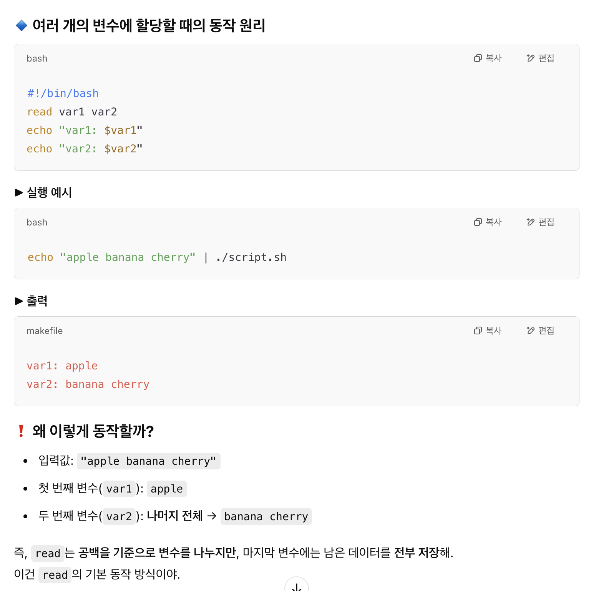

# Bash Programming

- 문제 풀면서 복습하는 기초적인 내용 정리

## 스크립트에 인자 전달

- sh 명령어로 스크립트 실행할 때 `sh ./personalized_echo.sh 정부영`과 같이 인자를 전달해주고

- 스크립트 내에서 `$1`, `$2`로 그 인자를 받아서 사용할 수 있다.

### stdin으로 전달

- `echo -e "hello\nworld" | ./script.sh`이나 `./script.sh < input.txt  # input.txt 파일에 hello와 world가 한 줄씩 저장되어 있음` 처럼 셸 스크립트에 표준 입력으로 전달되는 경우

- 이 표준 입력은 공백 혹은 줄바꿈으로 구분할 수 있다.

- `read 변수명`으로 받아서 사용할 수 있다. 이때 변수명은 임의로 스크립트에서 지정할 수 있다.

- 

## 조건문 규칙

- `if`, `fi`로 끝내는 것과 한 조건 명시하면 `; then`을 뒤에 붙여야 하는 것

- 그리고 `if [ "$bool" == "Y" ]`처럼 `[]`안에 조건을 명시할 때 괄호와 공백을 한칸 둬야 한다.

## bash에서 조건문에 수식 넣는 방법

- bash에서 수식으로 조건 연산을 할 때에는 `(())`안에 수식을 작성해야 한다.

- 조건문이라면 `if (( i % 2 != 0 ))`와 같이 사용해야 한다.
