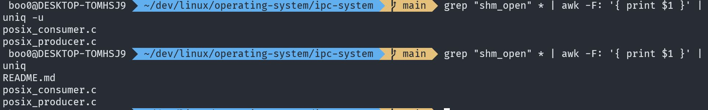

# uniq

- 중복된 내용을 제거해 한번만 출력하는 커맨드입니다.

- 주로 `sort` 커맨드와 함께 사용해서 정렬된 결과를 중복없이 하나의 값만 나열해서 확인할 때 사용합니다.

- 

- 어떤 내용을 가진 파일들을 `grep`을 사용해 조회해서 `awk`로 그 파일의 파일명을 출력하는 커맨드에서 `uniq`를 사용해 중복을 없애 출력하거나 중복되는 파일명만 혹은 중복이 되지 않는 파일명만 출력하도록 할 수 있습니다.

## 옵션별 의미

- `-d, --repeated` - 중복된 내용만 출력합니다.

- `-u, --unique` - 중복되지 않는 내용만 출력합니다.

- `-i, --ignore` - 대문자와 소문자를 구분하지 않고 중복 처리합니다. 예를 들어 KIM과 kim 그리고 Kim은 같은 것으로 간주됩니다.

