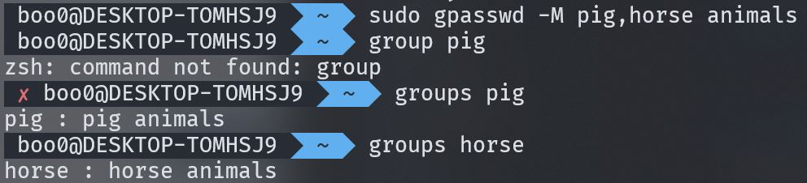

# addgroup

- 관리자 권한으로 `sudo addgroup [그룹 이름]`명령어로 그룹을 추가할 수 있습니다.

- 그룹의 GID는 작은 숫자부터 채워서 생성됩니다.

- 사용자를 그룹에 추가할 때는 `sudo adduser [사용자 이름] --ingroup [그룹 이름]`으로 사용자를 생성하면서 그룹에 추가할 수 있습니다.

- 이미 생성된 사용자를 그룹에 추가하는 경우 `usermod` 혹은 `gpasswd`를 사용할 수 있습니다.

- 그룹을 삭제할 때는 `delgroup`명령어를 사용할 수 있습니다.

## gpasswd

- 그룹에 사용자를 추가할 땐 `sudo gpasswd -a [사용자 이름] [그룹 이름]`을 사용합니다.

- 그룹에서 사용자를 삭제할 땐 `sudo gpasswd -d [사용자 이름] [그룹 이름]`을 사용합니다.

## usermod

- `usermod -g [그룹 이름] [사용자 이름]`

## gpasswd와 usermod의 차이

- 사용자를 추가할 때 사용자 이름과 같은 그룹 이름을 가지게 되는데 `gpasswd`는 그 그룹을 유지한 채 새로운 그룹에 추가합니다.

- `usermod`로 기존 사용자를 그룹에 추가한 경우 생성될 때 가졌던 자신의 사용자명과 같은 그룹을 유지하지 않고 새로운 그룹만을 자신이 속한 그룹으로 가지게 됩니다.

- 사용자는 새로운 그룹으로 옮겨졌지만 사용자명과 같은 이름으로 생성된 그룹은 여전히 존재하므로 `/etc/group`에서 확인해 그룹을 관리하는 것이 좋습니다.

- 

- 