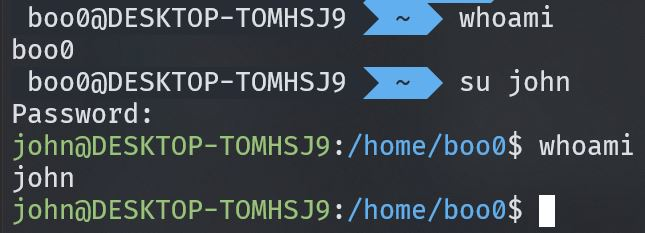
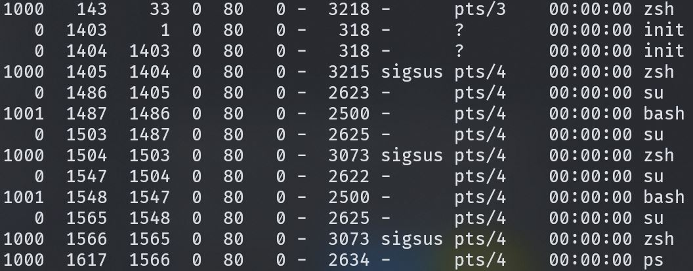

# adduser

- 사용자를 추가할 때 `adduser`를 사용할 수 있습니다. 

- 사용자를 추가하는 작업이기 때문에 관리자 권한이 필요합니다.

## su

- `su` switch user 명령어를 통해 셸에서 사용자 전환을 할 수 있습니다.

- 셸을 실제로 새로 실행시키는 것과 같이(사용자의 홈 디렉토리로 시작하는 것과 같은 환경) 사용자를 전환하려면 `su - [사용자 이름]`과 같이 `-`를 입력한 후 사용자 전환을 해야 합니다.

- 새로운 사용자로 전환한 후 `exit`명령어를 사용해 로그아웃 하고 전환 이전 사용자로 돌아올 수 있습니다.

- 

- `ps -el` 명령어를 통해 유저를 변경하면서 발생한 UID 1001을 가진 유저가 bash 셸을 실행한 기록을 프로세스 목록에서 확인할 수 있습니다.

- 

## deluser

- 사용자를 삭제하고자 할 때 `deluser [유저 이름]`을 사용할 수 있습니다.

- 사용자의 추가와 마찬가지로 관리자 권한이 필요합니다.

- 사용자를 삭제하더라도 삭제된 사용자의 홈 디렉토리는 그대로 남아있습니다. `sudo deluser [유저 이름] --remove-home`으로 `--remove-home`옵션을 사용해 홈 디렉토리도 동시에 삭제되게 할 수 있습니다.