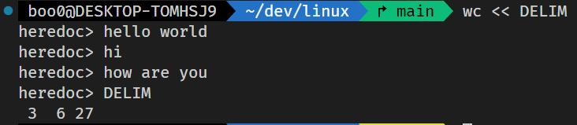
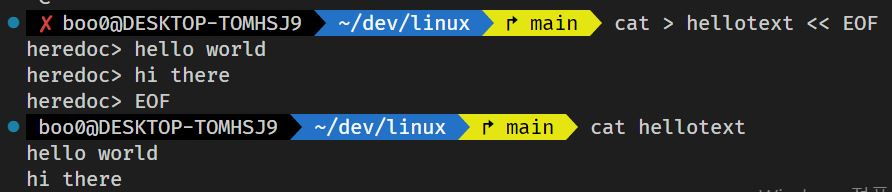

# Here Documents `<<`

- Here Documents는 입력 리디렉션의 하나입니다.

- 입력 리디렉션 `<`과 다른 점은 `커맨드 <<[DELIM]`으로 시작하여 DELIM의 입력 사이 까지의 멀티 라인 스트링을 리디렉션 하는 것입니다.

- 

- DELIMITER는 사용자 임의로 원하는 문자열을 입력할 수 있습니다.

- 출력 리디렉션과 함께 사용하면 다음과 같은 활용이 가능합니다.

- 

- cat 명령으로 인한 출력을 hellotext라는 파일에 저장하는데 cat이 출력할 결과를 Here Documents 리디렉션으로 DELIMITER를 EOF로 설정해서 입력 리디렉션 할 구문을 입력합니다.

