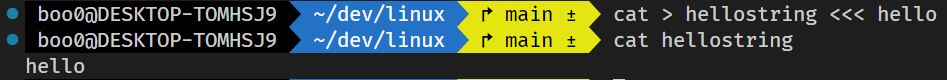

# Here Strings `<<<`

- Here Documents와 개념과 사용법이 동일하지만 Here Strings는 멀티 라인이 아닌 한 줄의 스트링만을 리디렉션합니다.

- 

- Here Strings는 한 단어만 가능하며 공백 등의 구분이 생기면 두 단어이므로 사용할 수 없습니다. 공백으로 구분되는 여러 단어라면 하나의 문자열이라는 것을 명시해주기 위해 `""` 사이에 문자열을 입력해야 합니다.

- 파이프라인을 통해 대체될 수 있는 여지가 있기 때문에 Here Documents보다 사용 빈도가 낮습니다.