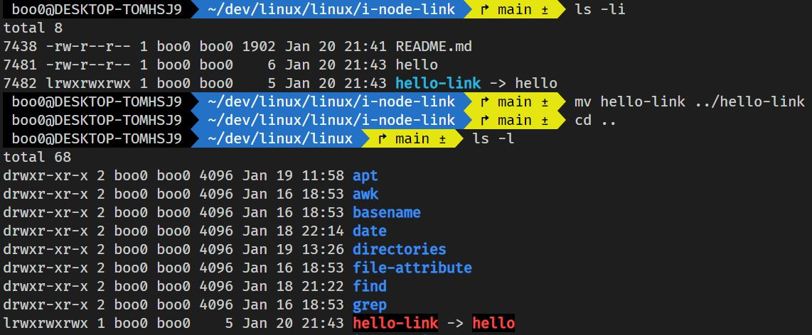
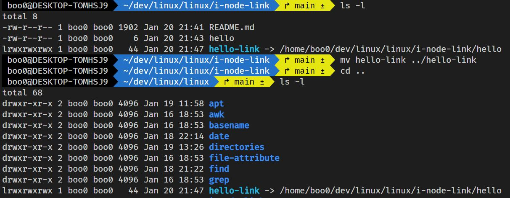

# 아이노드

- 아이노드는 파일에 대한 메타 데이터를 가진 노드이며 고유한 인덱스를 가집니다.

- 

- 파일은 이름과 아이노드를 가지고 생성될 때 아이노드의 인덱스를 부여받습니다. 그 후 아이노드 블록이 생성되고 파일에 대한 메타 데이터가 아이노드 블록에 저장됩니다.

- 

- 아이노드가 가지는 정보들은 위와 같고 해당 정보들은 자신의 정보에 해당하는 실질적인 데이터들을 가리키고 있습니다.

## 하드 링크

- A 파일이 B 파일에 대한 하드 링크 파일이라면 A 파일의 아이노드는 B 파일의 아이노드와 같습니다.

- B 파일의 아이노드가 공유가 되는 것이라고 볼 수 있고 두 파일은 다른 파일 이름을 가지지만 파일의 정체성인 아이노드가 같기 때문에 같은 내용을 가진 파일입니다.

## 소프트 링크

- A 파일이 B 파일에 대한 소프트 링크 파일이라면 A 파일의 아이노드는 B 파일에 대한 링크 데이터를 가리키고 있고 링크 데이터는 B 파일의 경로입니다.

## ln

- 링크 파일을 생성할 때는 `ln`명령어를 사용합니다. 사용법은 `ln [링크 대상 파일] [생성할 링크 파일]`이며 기본값은 하드링크이고 `-s`옵션을 사용하면 소프트 링크 파일을 생성할 수 있습니다.

## 경로에 따른 차이

- 소프트 링크는 링크 파일의 아이노드가 링크된 대상 파일의 경로를 데이터로 가리키고 있습니다. 그렇기 때문에 하드 링크는 서로 아이노드를 공유해서 자신의 경로가 달라져도 파일의 내용이 유지가 되지만 소프트 링크는 자신의 경로가 달라지면 링크가 제대로 동작하지 않습니다.

- 그리고 제대로 동작하지 않는 이유는 대상의 경로가 상대 경로로 저장되기 때문이고 절대 경로로 링크를 생성한다면 소프트 링크 파일의 경로가 바뀌더라도 링크가 제대로 동작합니다.

- 

- 