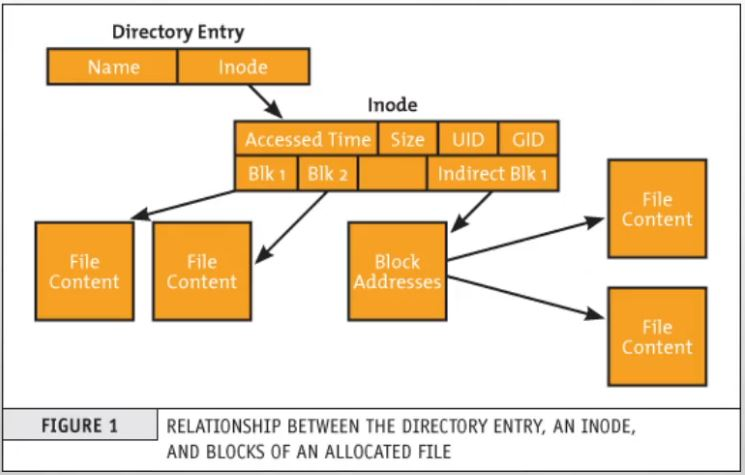
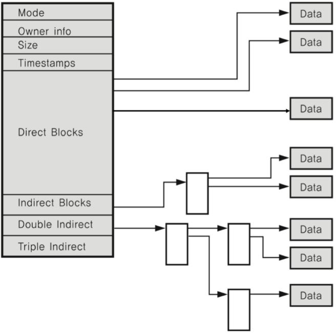

# 아이노드

- 아이노드는 파일에 대한 메타 데이터를 가진 노드이며 고유한 인덱스를 가집니다.

- 

- 파일은 이름과 아이노드를 가지고 생성될 때 아이노드의 인덱스를 부여받습니다. 그 후 아이노드 블록이 생성되고 파일에 대한 메타 데이터가 아이노드 블록에 저장됩니다.

- 

- 아이노드가 가지는 정보들은 위와 같고 해당 정보들은 자신의 정보에 해당하는 실질적인 데이터들을 가리키고 있습니다.

## 하드 링크

- A 파일이 B 파일에 대한 하드 링크 파일이라면 A 파일의 아이노드는 B 파일의 아이노드와 같습니다.

- B 파일의 아이노드가 공유가 되는 것이라고 볼 수 있고 두 파일은 다른 파일 이름을 가지지만 파일의 정체성인 아이노드가 같기 때문에 같은 내용을 가진 파일입니다.

## 소프트 링크

- A 파일이 B 파일에 대한 소프트 링크 파일이라면 A 파일의 아이노드는 B 파일에 대한 링크 데이터를 가리키고 있고 링크 데이터는 B 파일의 경로입니다.

