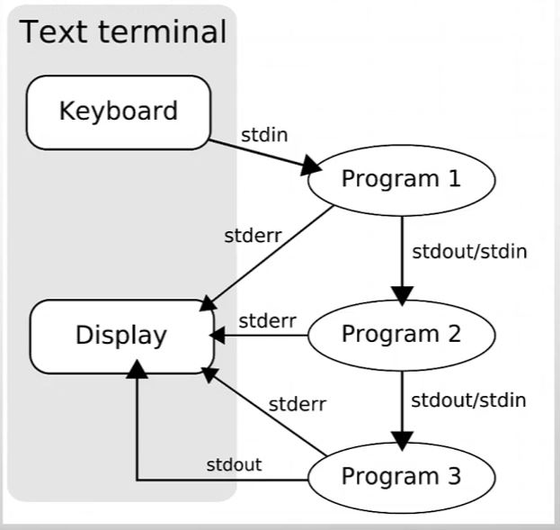

# 파이프 라인 `|`

- 파이프 라인은 프로그램 간 상호작용에 사용되는 개념이며 프로세스 간 스트림을 연결하는 역할을 합니다.

- 

- 커맨드와 커맨드 사이에 `|`를 표시해서 사용하며 `[커맨드1] | [커맨드2]`의 경우 커맨드 1의 표준 출력이 커맨드2의 표준 입력과 연결됩니다.

- `|&`으로 사용할 경우 앞 커맨드의 표준 출력과 표준 에러 모두 뒤 커맨드의 표준 입력으로 연결됩니다.

- 전체 파이프 라인 내 각 커맨드는 sub-shell에서 실행되고 종료 상태는 마지막 커맨드의 종료 상태를 갖게 됩니다.

- 이 경우 중간에 다른 커맨드가 성공했는지 실패했는지 확인할 수 없습니다. 셸에서 pipefail 옵션을 사용한다면 실패한 커맨드가 생겼을 때 실패 처리를 합니다.