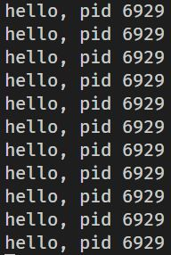
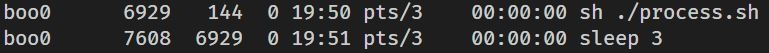
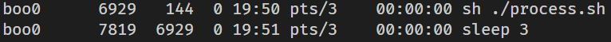

# ps

- `ps`명령어는 현재 실행중인 프로세스의 목록과 정보를 보여줍니다.

- `ps -A` 혹은 `ps -e`를 통해 모든 프로세스를 조회하면 모든 프로세스들이 서로 부모 자식 관계임을 알 수 있습니다.

- process.sh 스크립트 파일을 실행시켜서 `echo $$`로 현재 실행중인 프로세스의 PID를 출력하도록 합니다. `$$`는 현재 실행중인 프로세스의 PID를 가리키는 변수입니다. 그리고 `sleep 3` 이라는 구문을 추가해서 출력과 출력 사이에 3초의 대기 시간을 갖도록 합니다.

- 

- 

- 스크립트 파일의 프로세스와 sleep을 수행하는 프로세스가 서로 부모 자식 관계임을 확인할 수 있습니다.

- 

- sleep을 수행하는 프로세스는 자신의 역할을 다하면 종료되고 또 새로운 sleep을 수행하는 자식 프로세스를 스크립트 파일의 프로세스가 생성하는 것을 확인할 수 있습니다.

## --forest

- `ps -[옵션] --forest`명령어를 사용하면 프로세스들의 계층 구조를 트리 형태로 출력해줍니다.