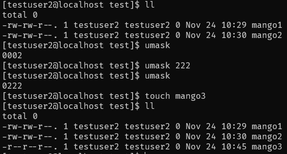

# SeSAC 리눅스

- 두서없이 하니까 두서없이 정리

#### 사용자

- 시스템을 사용하려는 사람과 연결된 계정이다.

- UID로 구분된다.

#### 그룹

- 공통의 목적을 가진 사용자들이 모인 집합, 파일의 권한을 공유할 때 사용한다.

- GID로 구분된다.

- 모든 사용자는 최소 하나의 그룹에 포함된다.

#### 계정 정보 파일

- `/etc/passwd` - 시스템에 등록된 사용자 정보

- `/etc/shadow` - 패스워드

- `/etc/group` - 시스템에 등록된 그룹 정보

- `/etc/gshadow` - 그룹 패스워드

#### `su -` vs `su`

- `-` 옵션을 주면 홈 디렉토리로 이동하면서 로그인한다. ***그리고 로그인하려는 사용자의 환경변수를 읽어온다.***

- 환경변수를 읽어올 수 있는 이유는 `su -`하면 해당 사용자가 셸에 설정해둔 홈 디렉토리의 설정 파일(bash_history 등)을 읽어오기 때문이다.

- 그냥 `su`를 하면 현 디렉토리를 유지하면서 로그인한다.

#### substitute user

- `su`의 의미는 로그아웃을 하지 않고 사용자를 전환하는 것이다. `su`로 로그인 한 후 `exit`했을 때 기존 사용자로 돌아가는 것을 생각하면 이해할 수 있다.

#### useradd

- 시스템을 사용할 다른 사람을 위해 생성한 사용자에 대한 코멘트를 `-c` 옵션을 사용해서 작성할 수 있다.

- `useradd -c [코멘트] [사용자명]`

#### umask

- 파일을 생성할 때 설정되는 권한의 기본값을 설정하는 명령어이다.

- `umask [값]`으로 기본값에서 뺄 umask의 기본값을 설정할 수 있다.

- 파일의 권한 기본값은 666이고 디렉토리는 777이다.

- umask의 값을 기본값에서 빼서 생성될 때의 기본값을 정한다.

- ex) 666 - 002 = 664

- 

#### more

- 출력을 페이지 단위로 나눠서 확인할 수 있다.

- ex) `cat /etc/passwd | more`

#### /etc/ssh/sshd_config

- ssh의 config 파일로 root 유저에 대한 SSH 불허 등의 옵션을 작성하는 등 configuration이 가능하다.

