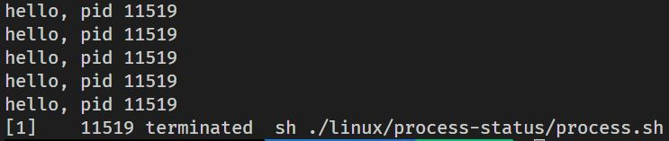
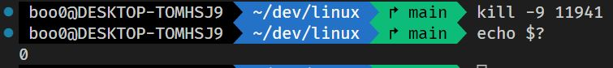
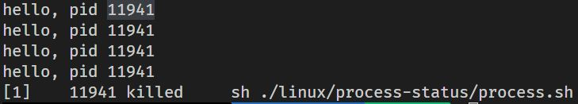
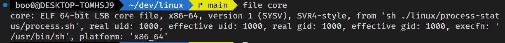

# 프로세스 종료하기

- `process.sh` 스크립트 파일을 실행한 다음 `kill -[시그널 번호] [pid]` 명령어로 프로세스를 종료시킬 수 있습니다.

- SIGTERM을 사용했을 떄의 결과는 다음과 같습니다.

- 

- 

- SIGKILL을 사용했을 때의 결과는 다음과 같습니다.

- 

- 

## 코어 덤프

- `ulimit` 명령어를 사용해서 코어 파일의 크기를 0이 아닌 크기로 재설정해서 코어 파일이 남을 수 있도록 변경합니다.

- `ulimit -a`로 파일의 최대 크기가 몇으로 설정되어 있는지 확인할 수 있고 `ulimit -c [파일 크기]`로 코어 파일의 최대 크기를 설정할 수 있습니다.

- SIGABRT를 사용해서 종료시킨 후 생성된 코어 파일을 확인할 수 있습니다.

- 

- 코어 파일의 정보를 가지고 프로세스의 분석을 할 수 있습니다.