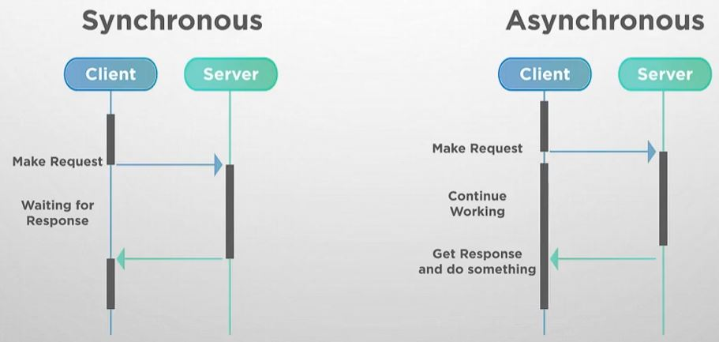

# 시그널

- 시그널은 비동기 이벤트를 처리하기 위한 프로세스간의 통신을 의미합니다.

- 

- 동기 방식은 클라이언트에서 요청을 보내고 응답이 도착할 때 까지 기다리는 방식이고 비동기 방식은 요청을 보낸 후 작업을 계속하다가 응답을 받는 방식입니다.

- 시그널은 데이터의 전송이 아닌 알림으로서의 역할을 하며 프로세스 간에 양방향이 아닌 한 방향으로 보내집니다.

- 시그널은 번호를 전달합니다. 번호마다 의미가 정해져 있습니다. 어떤 시그널 넘버가 전달되는 지에 따라 다르게 동작하도록 프로그램을 만들 수 있습니다.

- [!image](../img/signals.JPG)

## 기본 처리

- 시그널을 받은 프로세스가 시그널의 의미대로 수행된 후 프로세스를 재개할 것 인지, 종료할 것 인지 등을 시그널 별로 명시해둔 내용입니다.

## 코어 덤프 

- 프로세스가 비정상적으로 종료되는 경우(자식 프로세스가 자신의 할 일을 마친 후 부모 프로세스가 종료 처리를 해주지 않은 경우) 동작 상태를 기록해 둔 코어 파일을 반환하고 종료하는 것을 말합니다.

## SIGINT

- 사용자가 인터럽트를 발생시키고 프로세스를 종료하는 시그널입니다.

- 셸에서 프로세스가 작업을 하는 도중 `Ctrl + C`로 종료를 시키는 경우 이 시그널로 해당 프로세스에 인터럽트를 일으키고 프로세스를 종료시키는 것입니다.

## SIGTERM

- 프로세스를 즉시 중지시키지 않고 프로세스가 현재 어떤 조건에서 동작하고 있는 지에 따라 다르게 중지시키는 시그널입니다.

## SIGKILL

- 프로세스를 즉시 강제 종료시킵니다.

## SIGCHLD

- 자식 프로세스가 종료되었을 때 운영체제가 부모 프로세스에게 자식 프로세스가 종료되었음을 전달하는 시그널입니다.

- 부모 프로세스는 이 시그널을 받으면 자신의 작업을 멈추고 종료된 자식 프로세스에 대한 종료 처리를 진행합니다.