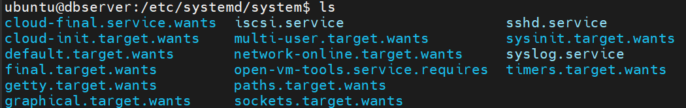
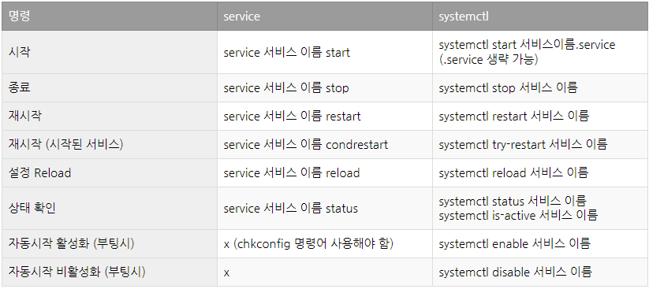

# service, systemctl

- 리눅스 시스템에서 실행되는 모든 데몬 프로세스들은 service 파일로 실행되며 systemd라는 프로세스가 관리한다.

- 데몬으로 실행되는 시스템 데몬, 사용자 정의 데몬을 service라고 하며 systemctl은 service들을 관리하는 명령어이다.

- 

## service vs systemctl

- 명령어로서 service와 systemctl의 차이는 CentOS7버전 부터 systemctl이 사용되기 시작했고 이전 버전에서는 service 명령어 만으로 가능하다. 7버전부터의 버전에서도 service 명령어는 사용이 가능하다.

- 