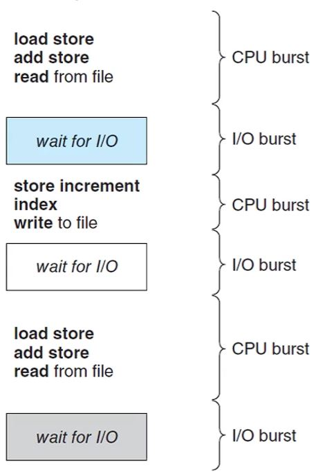
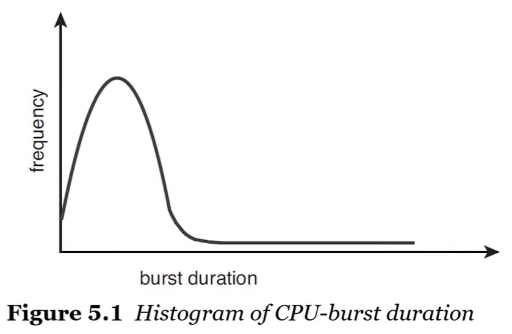
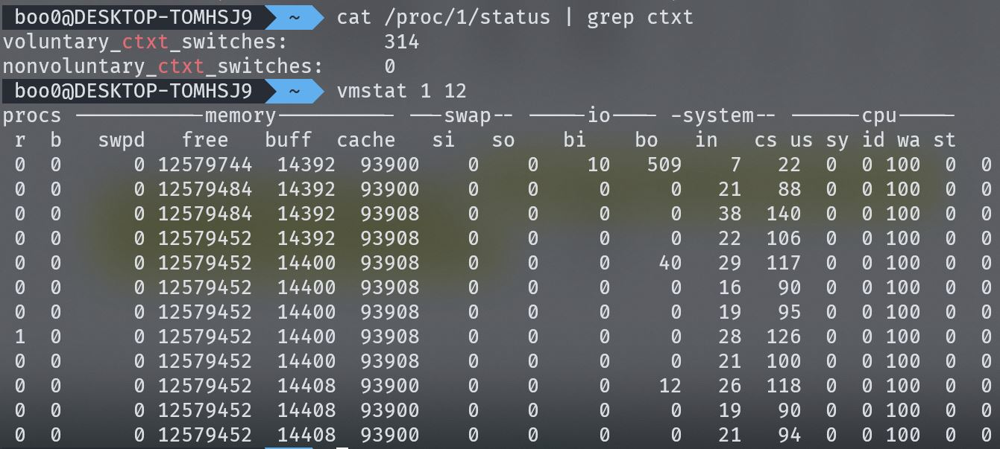

# CPU 스케줄링 기본 개념

- CPU 스케줄링은 멀티 프로그래밍이 가능한 운영체제의 기본이 되는 개념입니다.

- 멀티 프로그래밍의 목적은 실행 가능한 프로세스들을 동시에 실행하는 것이며 CPU를 최대한 활용하는 것입니다.

- 

- 프로세스가 CPU를 통해 읽거나 쓰는 등의 작업을 하는 running 상태인 시간은 CPU 버스트라고 하며 입출력을 기다리기 위해 대기하는 wait 상태인 시간을 I/O 버스트라고 합니다.

- 

- 대부분의 프로세스들은 입출력 중심의 프로그래밍으로 짧은 CPU 버스트를 가집니다. 

- 멀티 프로그래밍은 CPU의 활용을 극대화하기 위해 한 프로세스가 running 상태일 수 없다면 다른 프로세스가 CPU를 사용하게 합니다.

- 프로세스가 CPU 버스트가 짧고 입출력을 기다리는 시간이 더 많다면 CPU를 점유하는 프로세스의 교체가 더 빈번할 것입니다.

## CPU 스케줄러

- CPU 스케줄러는 메모리에 로드되어 있는 프로세스들 중 실행 가능한 프로세스에 CPU를 할당하는 역할을 합니다.

- CPU 스케줄러를 구현하기 위해서 고려되어야 할 점은 CPU 점유에 대한 우선순위입니다.

- 만약 우선순위 큐로 CPU 스케줄러를 구현한다면 어떤 CPU가 우선순위를 갖는 지, CPU의 활용을 극대화할 수 있도록 순위를 정할 수 있는 기준을 세워야 합니다.

## 선점형 vs 비선점형

- 선점이 가능하다는 것의 의미는 CPU가 이미 다른 프로세스에 의해 사용중인 상태일 때 사용을 중단시키고 자신이 CPU를 사용할 수 있다는 것입니다.

## 비선점형 스케줄링

- 프로세스는 종료되거나 wait 상태에 놓이기 전까지 CPU를 계속해서 사용합니다.

## 선점형 스케줄링

- 프로세스가 우선순위가 높다면 사용중인 프로세스를 ready 큐로 보내고 자신이 CPU를 사용할 수 있습니다.

## 디스패처

- CPU 스케줄러가 CPU 코어의 제어를 할 수 있도록 문맥 교환을 가능하게 해주는 모듈입니다. 

- 커널 모드에서 유저 모드로의 전환을 가능하게 해주고 CPU를 사용하다가 입출력을 기다리며 wait 상태이던 프로세스를 중단된 시점부터 재개할 수 있도록 해줍니다.

## 디스패처 지연시간 (Dispatcher Latency)

- 한 프로세스를 중단하고 다른 프로세스를 실행하는 데에 걸리는 시간을 의미합니다.

- 현재 실행중인 프로세스의 PCB를 저장하고 다른 실행될 프로세스의 PCB를 복구하는 데에 걸리는 시간으로 볼 수 있습니다.

## 문맥 교환 모니터링

- 

- `vmstat` 명령어를 통해 초당 문맥 교환이 일어나는 횟수를 알 수 있고 `/proc/1/status` 파일을 통해 선점형(nonvoluntary)으로 일어난 문맥 교환의 수와 비선점형(voluntary)으로 일어난 문맥 교환의 수를 알 수 있습니다. 