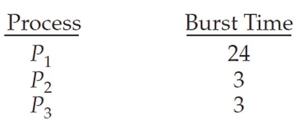
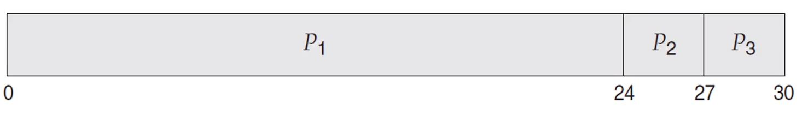
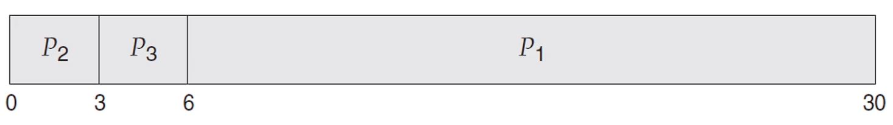

# FCFS 스케줄링

- 가장 간단한 스케줄링 알고리즘으로 먼저 들어온 프로세스를 먼저 실행시킵니다.

- 선입선출 큐로 간단하게 구현할 수 있습니다.

## 호위 효과

- 다음과 같은 CPU 버스트 타임을 갖는 프로세스들이 있다고 가정하겠습니다. 단위는 밀리세컨드입니다.

- 

### 긴 프로세스가 먼저인 경우

- 

- 위의 경우 대기 시간은 `0 + 24 + 27`으로 총 `51ms`이며 평균 대기 시간은 `17ms`입니다.

- 총처리 시간은 `24 + 27 + 30`으로 총 `81ms`입니다.

### 짧은 프로세스가 먼저인 경우 

- 

- 위의 경우 대기 시간은 `0 + 3 + 6`으로 총 `9ms`이며 평균 대기 시간은 `3ms`입니다.

- 총처리 시간은 `3 + 6 + 30`으로 총 `39ms`입니다.

### 문제점

- FCFS 정책하에서 CPU중심 프로세스와 입출력 중심 프로세스가 공존해서 프로세스들의 CPU 버스트 타임이 크게 차이날 경우 대기 시간의 총량이 늘어나며 CPU와 장치의 활용도가 떨어지는 상황이 발생할 수 있습니다.

- 이것을 호위 효과라고 합니다.