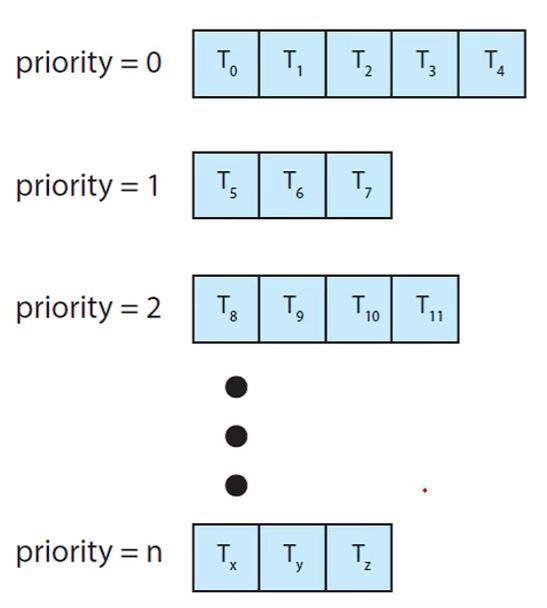
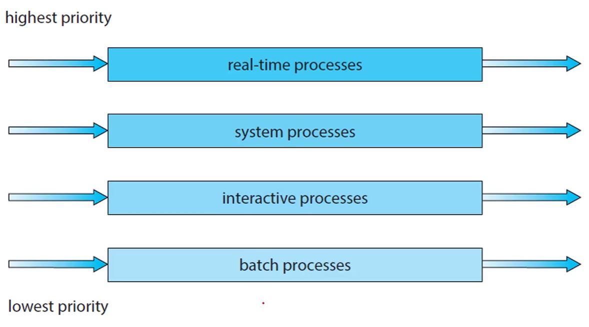
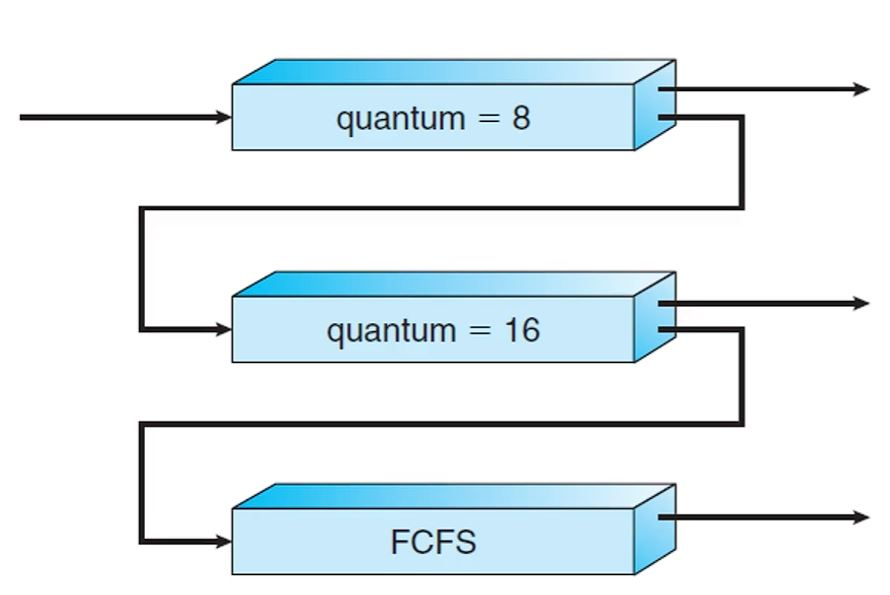

# 다단계 큐(Multi-Level Queue) 스케줄링

- 

- 

- 다단계 큐 스케줄링은 프로세스의 성질에 따라 각각 다른 큐에 담아 그 큐에 우선순위를 부여해 처리하는 방식입니다.

# 다단계 큐 피드백 스케줄링

- 

- 하나의 큐가 실행되고난 후 해당 큐에 대해 피드백을 반영해 큐 안에 있는 프로세스들의 CPU 버스트가 길다면 시간 할당량을 늘리는 등의 처리를 해서 성능을 향상시키는 방식입니다.