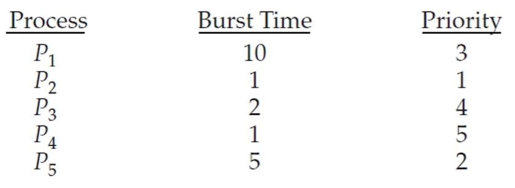
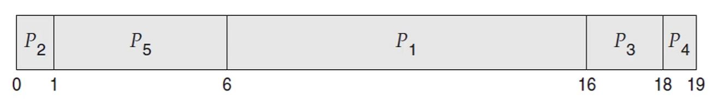
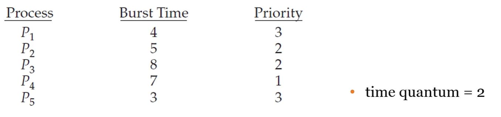
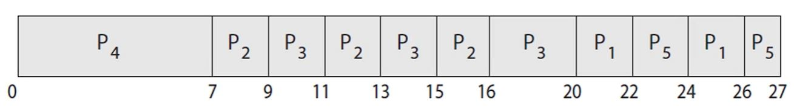

# 우선순위 기반 스케줄링

- 우선순위 기반 스케줄링은 각 프로세스에 우선순위를 부여해 우선순위가 높은 프로세스를 FCFS로 처리하는 스케줄링입니다.

- SJF도 CPU 버스트가 짧은 프로세스에 우선순위를 부여하는 우선순위 기반 스케줄링의 한 종류입니다.

- 다음은 우선순위에 기반한 스케줄링의 한 예시입니다.

- 

- 

## 우선순위 기반 스케줄링의 문제점

- 우선순위 기반 스케줄링을 선점형 스케줄링으로 구현할 경우 우선순위가 계속 밀려서 대기가 끝나지 않는 blocked 프로세스가 생길 수 있습니다.

- 이 문제의 해결 방법은 aging 방식으로 대기 시간이 늘어나는 프로세스의 우선순위를 기존의 우선순위를 정하는 기준에 부합하지 않더라도 높여주는 방식입니다.

## 라운드 로빈과 우선순위 스케줄링의 결합

- 스케줄링 알고리즘은 여러가지 방식이 쓰일 때 더 높은 효율을 낼 수 있습니다.

- 우선순위 기반 스케줄링을 구현할 때 우선순위가 같은 경우 라운드 로빈 스케줄링으로 프로세스가 실행되도록 하는 방법입니다.

- 

- 

