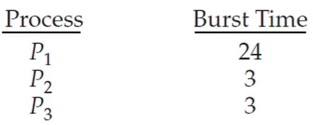
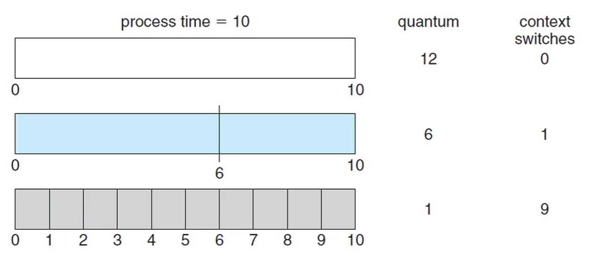
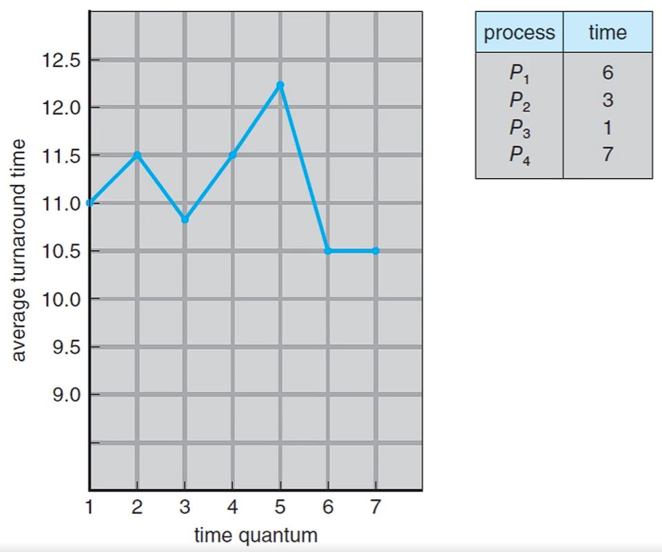

# Round-Robin 스케줄링

- 라운드 로빈 스케줄링은 `시간 할당량(time quantum)이라는 개념을 사용하는 선점형 FCFS 스케줄링`입니다.

- 스케줄러의 성능은 시간 할당량의 크기와 프로세스들의 CPU 버스트 크기에 따라 달라집니다. 

- 시간 할당량은 10 ~ 100ms의 크기를 가진 시간의 단위를 의미합니다.

- 라운드 로빈에서 ready 큐는 순환 큐로 볼 수 있습니다.

- ready 큐에 있는 프로세스들을 시간 할당량 만큼 실행한 후 해당 프로세스가 종료가 되지 않더라도 OS가 인터럽트를 걸어 다음 프로세스로 문맥 교환이 일어나고 해당 프로세스는 ready 큐의 tail로 shift됩니다.

- CPU 버스트가 시간 할당량 보다 작은 경우 프로세스는 CPU를 자발적으로 반납하고 스케줄러는 다음 프로세스를 CPU에 할당합니다.

- 

- 실행될 프로세스들의 목록이 위와 같고 시간 할당량이 4ms인 경우 실행 순서는 다음과 같습니다.

- 

- 위의 경우 총 대기 시간은 `4 + 7 + 6`으로 `17ms`이고 평균 대기 시간은 약 `5.67ms`입니다.

- 총 처리 시간은 `7 + 10 + 30`으로 `47ms`입니다.

## 시간 할당량의 크기에 따른 성능 차이

- 

- 프로세스들의 CPU 버스트와 시간 할당량의 크기가 어떤 지에 따라서 문맥 교환이 일어나는 횟수가 달라지고 성능에 차이가 생길 수 있습니다.

- 

- 총 처리 시간도 시간 할당량의 크기에 따라서 달라집니다.

