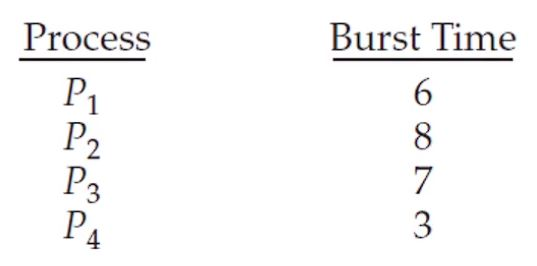
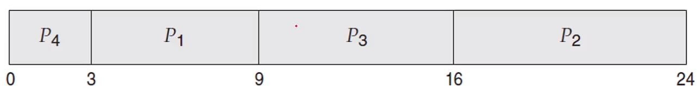

# SJF 스케줄링

- 가장 짧은 CPU 버스트를 가진 프로세스를 먼저 실행하도록 합니다.

- SJF는 각 프로세스의 다음 CPU 버스트를 고려하고 그것이 가장 작은 프로세스를 들어온 순서와 상관없이 먼저 실행합니다.

- 다음과 같은 프로세스들이 준비 상태에 있다고 가정해보겠습니다.

- 

- 짧은 CPU 버스트를 가진 프로세스들을 오름차순으로 나열합니다.

- 

- 위의 경우 대기 시간은 `0 + 3 + 9 + 16`으로 총 `28ms`이며 평균 대기 시간은 `7ms`입니다.

- 총처리 시간은 `3 + 9 + 16 + 24`로 총 `52ms`입니다.