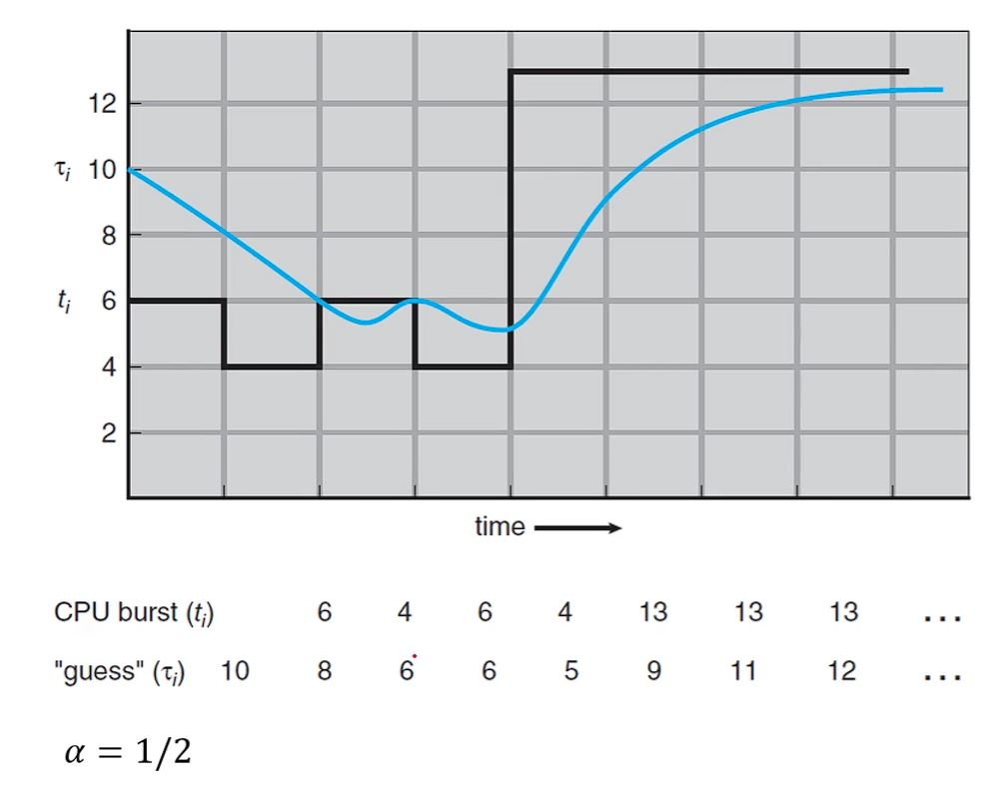

# SJF 스케줄링

- 가장 짧은 CPU 버스트를 가진 프로세스를 먼저 실행하도록 합니다.

- SJF는 각 프로세스의 다음 CPU 버스트를 고려하고 그것이 가장 작은 프로세스를 들어온 순서와 상관없이 먼저 실행합니다.

- 다음과 같은 프로세스들이 준비 상태에 있다고 가정해보겠습니다.

- 

- 짧은 CPU 버스트를 가진 프로세스들을 오름차순으로 나열합니다.

- 

- 위의 경우 대기 시간은 `0 + 3 + 9 + 16`으로 총 `28ms`이며 평균 대기 시간은 `7ms`입니다.

- 총처리 시간은 `3 + 9 + 16 + 24`로 총 `52ms`입니다.

## SJF의 구현

- SJF는 최적화된 알고리즘으로 보이지만 다음 CPU 버스트를 미리 알 수 없기 때문에 구현에 어려움이 있습니다.

- 다음 CPU 버스트를 정확히 알 수는 없지만 이전의 CPU 버스트를 통해 다음 CPU 버스트도 비슷할 것이라고 예측한다면 구현이 가능합니다.

- SJF는 이전 CPU 버스트의 길이들을 지수적으로 평균을 내서 다음 CPU 버스트를 예측합니다.

- 

- 타우 n+1은 다음 CPU 버스트이고 타우 n은 바로 이전 CPU 버스트이며 알파는 0과 1사이의 값을 가지는 가중치 파라미터입니다.

- 

- 알파는 1/2이고 첫번째 예측 CPU 버스트는 10이고 실제 CPU 버스트는 6이였습니다. 다음 예측 CPU 버스트는 10 x 1/2 + 6 x 1/2로 8입니다.

- 예측 CPU 버스트가 8일때 실제 CPU 버스트는 4였고 다음 예측 CPU 버스트는 8 x 1/2 + 4 x 1/2로 6입니다.

- 공식을 통해 그려낸 위와 같은 지수적 평균의 곡선이 실제 CPU 버스트의 그래프를 따라가는 것을 확인할 수 있습니다.

## 선점형 vs 비선점형

- CPU 버스트가 5ms인 프로세스가 현재 실행중입니다.

- 그런데 CPU 버스트가 1ms인 프로세스가 새로 ready 큐에 들어왔다면 SJF 알고리즘은 선점형인지 비선점형인지에 따라 다른 솔루션을 갖습니다.

- 선점형이라면 1ms인 프로세스가 먼저 실행되고 5ms인 프로세스가 대기합니다. 이럴 경우 대기 시간을 더 줄일 수 있습니다.

- 비선점형이라면 현재 실행중인 프로세스를 종료한 후 남은 프로세스들 중 CPU 버스트가 짧은 순서대로 실행시킵니다.