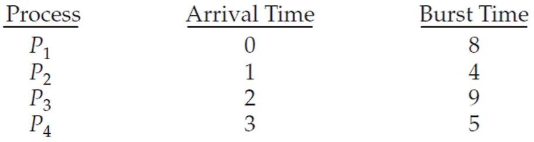
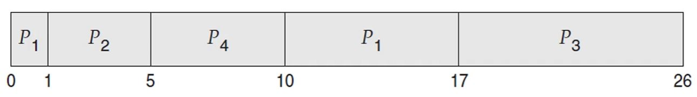

# SRTF 스케줄링

- SRTF는 남아있는 CPU 버스트가 가장 짧은 프로세스를 먼저 실행시키는 `선점형 SJF 스케줄링`입니다.

- 

- ready 큐에 프로세스들이 위와 같은 순서로 도달하는 경우        
        
  SRTF는 선점형 스케줄링 알고리즘이기 때문에 P2가 P1보다 CPU 버스트가 더 짧기 때문에 CPU를 선점합니다.

- 위의 예시에서 대기 시간은 `대기 시간 - 도착 시간`입니다.

- 총 대기 시간은 `[(10 - 1) + (1 - 1) + (17 - 2) + (5 - 3)] = 26ms`이고 평균 대기 시간은 `6.5ms`입니다.