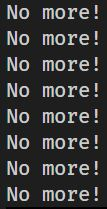
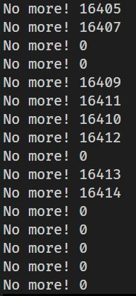
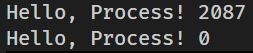

# fork()

- UNIX-like 운영체제에서 새로운 프로세스는 `fork()`라는 시스템 콜에 의해 생성됩니다.

- 자식 프로세스는 부모 프로세스의 주소 공간의 복사본입니다.

- 함수로서의 `fork()`는 함수가 호출된 프로세스를 복사하고 반환값은 프로세스의 pid입니다.

## 무한 증식이 되지 않는 이유

- `fork()`를 호출한 프로세스의 자식 프로세스도 코드에 `fork()`를 호출하는 내용이 담겨있지만 무한 증식이 되지 않는 이유는 `fork()` 시스템 콜은 부모 프로세스의 주소 공간을 복사하는 것이기 때문에 이전 부모 프로세스의 코드 실행은 `fork()`를 호출한 다음을 실행할 순서이고 자식 프로세스도 그것을 그대로 이어받아 다음 순서부터 실행하기 때문입니다.

- pid가 가지는 `fork()`의 반환값은 OS가 할당해주는 것이기 때문에 자식 프로세스가 `fork()`를 호출하고 반환값을 할당받는 줄의 코드를 실행하지 않았더라도 서로 다른 값을 가지게 됩니다.

## fork의 호출 수와 프로세스의 수

- 부모 프로세스가 `fork()`를 N번 호출한다면 총 프로세스의 수는 2의 N제곱이 됩니다.

- how_many_process.c 파일은 부모 프로세스가 fork를 3번 호출하는 코드를 실행했고 결과는 다음과 같이 총 8개의 프로세스가 생성됩니다.      
  

- how_many_process2.c 파일은 16개의 프로세스가 생성됩니다.      
  

## pid 

- pid는 프로세스의 고유한 id입니다.

- 모든 사용자 프로세스의 부모 프로세스인 루트 프로세스는 pid가 1인 init 프로세스입니다.

## ppid 

- ppid는 부모 프로세스의 id를 의미합니다. 

- `ps -el`명령어를 통해 실행되었던 모든 프로세스들의 상세한 정보를 확인할 수 있습니다. 

- 

## print_pid2

- print_pid2.c 파일을 보면 `fork()`함수의 반환 값을 변수 pid에 할당한 후 출력하는 내용을 볼 수 있습니다.

- `fork()`함수의 반환 값은 규칙이 있는데 부모 프로세스에서의 호출에선 자식 프로세스의 pid를 반환하고 자식 프로세스에서의 호출에선 0을 반환하는 것입니다.

- 