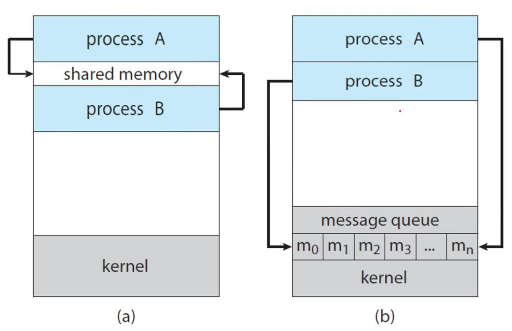

# Interprocess Communication

- 프로세스 실행의 동시성은 프로세스들이 독립적으로 실행중일 때에는 서로 공유하는 데이터가 없기 때문에 문제없이 이루어지지만 서로 공유하는 데이터가 있는 연관된 협력 프로세스의 경우 서로 영향을 주기 때문에 아무 문제가 없다고 단정 지을 수 없습니다.

- 문제가 생길 경우 해결을 위해 협력 프로세스 간 통신을 하는 것이 IPC입니다.

- IPC는 프로세스 사이에 데이터를 주고 받을 수 있게 해줍니다.

- IPC는 메모리를 공유하는 방법과 메세지를 주고 받는 메세지 패싱 방법이 있습니다.

- 

- 공유 메모리를 사용하는 경우 프로세스 사이에 주고 받을 데이터를 공유 메모리에 보냅니다.

- 메세지 패싱 방법은 프로세스가 다른 프로세스로 보낼 메세지를 메시지 큐로 보내고 운영체제가 이것을 다른 프로세스로 보냅니다.

## 생산자 소비자 문제

- 협력 프로세스의 개념이 어떤 것인지 설명하는 것이 생산자-소비자 문제로 생산자와 소비자로서의 관계로 이해하기 위한 개념입니다.

- 생산자는 정보를 생산하고 소비자는 그것을 소비합니다. 

- 예를 들어 컴파일러는 어셈블리 코드를 생산하고 어셈블러는 그것을 소비합니다. 웹 서버는 HTML 파일을 생산하고 브라우저는 그것을 소비합니다.

## 공유 메모리 방식

- 공유 메모리를 사용하면 데이터의 생산과 소비가 동시에 일어날 수 있기 때문에 생산자와 소비자가 동시에 실행할 수 있습니다.

- 실제 물리 메모리 영역에 두 프로세스 사이의 통신을 위한 버퍼를 할당하고 생산자는 버퍼를 채우고 소비자는 버퍼를 비웁니다.

- 공유 메모리 방식은 프로그램을 만드는 사람이 직접 여러 프로세스 사이의 공유 메모리를 접근하고 조정하는 코드를 직접 작성해야하는 단점이 있습니다.

## 메세지 패싱

- 메세지 패싱은 운영체제가 협력 프로세스들에게 데이터 통신을 할 수 있도록 제공하는 수단입니다.

- 공유 메모리 방식과 메세지 패싱 방식의 C로 작성한 코드 상의 차이는 다음과 같습니다.

- ```C
  // 버퍼의 정의
  #define BUFFER_SIZE = 10;
  typedef struct{
    // 공유할 데이터
  } item;
  item buffer[BUFFER_SIZE];

  int in = 0;
  int out = 0;
  ```
  ```C
  // 생산자의 공유 메모리 관리 코드
  item next_produced;

  while (true){
    while(((in + 1) % BUFFER_SIZE) == out)
        ;   // in 바로 다음이 out이라면 버퍼가 가득 찬 상태이므로 동작 X
    buffer[in] = next_produced;
    in = (in + 1) % BUFFER_SIZE;
  }
  ```
  ```C
  // 소비자의 공유 메모리 관리 코드
  item next_consumed;

  while (true){
    while(in == out)
        ;   // in과 out이 같다면 버퍼가 빈 상태이므로 동작 X
    next_consumed = buffer[out];
    out = (out + 1) % BUFFER_SIZE;
  }
  ```
- ```C
  // 생산자의 메세지 패싱 코드
  message next_produced;
  
  while (true){
    send(next_produced);
  }
  ```C
  // 소비자의 메세지 패싱 코드
  message next_consumed;
  while(true){
    receive(next_consumed);
  }

- 메세지 패싱 방식을 사용할 경우 운영체제가 데이터 통신을 관리해주기 때문에 코드가 간결해지는 장점이 있습니다.

## 커뮤니케이션 링크

- 두 프로세스가 메세지 패싱 방식으로 통신하기 위해서는 커뮤니케이션 링크로 서로 연결되어야 합니다.

- 커뮤니케이션 링크는 직접/간접 커뮤니케이션, 동기/비동기 커뮤니케이션, 자동적/명시적 커뮤니케이션과 같은 여러 방식으로 구현될 수 있습니다.

## 직접 커뮤니케이션

- 직접 커뮤니케이션은 받는 사람과 보내는 사람을 반드시 명시해야 합니다.

- `send(P,message)`, `receive(Q, message)`와 같이 어떤 프로세스가 주는지 혹은 받는지를 명시해야 합니다.

- 이와 같은 방식으로 구현한 커뮤니케이션 링크는 항상 생산자와 소비자 한 쌍의 프로세스로 이루어진 하나의 링크만 생길 수 있습니다.

## 간접 커뮤니케이션

- 간접 커뮤니케이션은 추상화된 객체인 메일 박스(포트)로 데이터를 보내고 받는 커뮤니케이션 링크입니다.

- 운영체제는 메일 박스를 생성하고 삭제하는 기능을 제공합니다.

- `send(A, message)`, `receive(A, message)`와 같이 A라는 포트로 데이터를 보내거나 메일 박스로부터 데이터를 받습니다.

- 간접 커뮤니케이션 링크는 프로세스가 서로 통신할 때만 링크가 형성되며 포트를 통해 여러 프로세스가 이용할 수 있습니다. 그러므로 하나 이상의 서로 다른 링크가 생길 수 있습니다.

## 구현에서의 디자인 옵션

- 커뮤니케이션 링크를 구현할 때 디자인 옵션으로 동기(블로킹) 방식과 비동기(논블로킹) 방식이 있습니다.

- Blocking send는 받는 프로세스가 데이터를 다 받을 때 까지 보내는 사람은 작업을 멈추고 기다립니다.

- Blocking receive는 받는 프로세스가 데이터가 사용 가능해지기 전까지 작업을 멈추는 것입니다.

- Non-blocking send는 보내는 프로세스는 데이터를 보내고 자신의 작업을 계속합니다.

- Non-blocking receive는 데이터를 받는 작업을 시작하지만 그것을 완료하기 이전에 자신의 작업을 계속하는 것입니다.

- 데이터를 보내고 받는 과정이 완료된 상태를 동기화된 상태라고 합니다. 그렇기 때문에 블로킹 방식은 동기 방식이라고 할 수 있습니다.

- 논블로킹 방식은 데이터의 동기화를 기다리지 않고 자신의 작업을 진행하기 때문에 비동기 방식이라고 할 수 있습니다.
