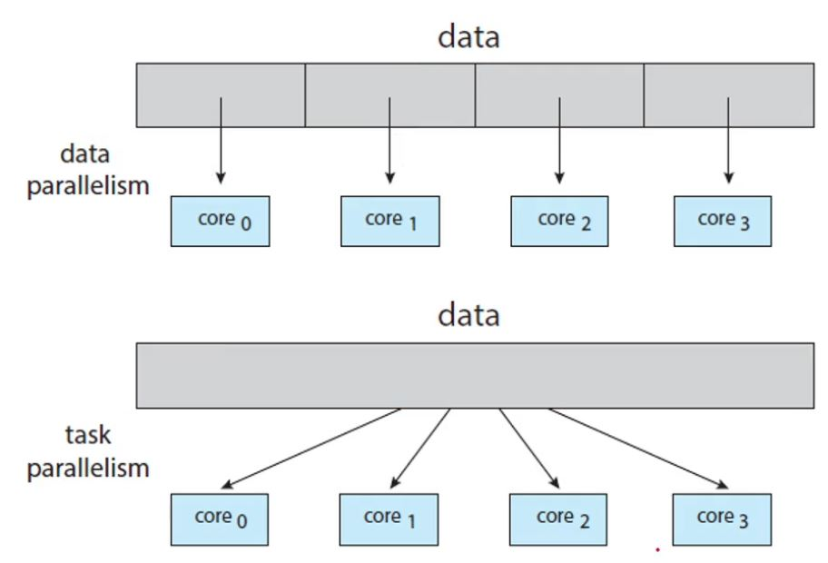
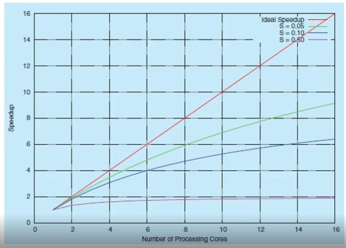

# 멀티 코어 시스템에서의 멀티 스레딩

- 멀티 스레딩은 다수의 코어를 사용하는 경우 시분할없이 여러 스레드가 동시에 병렬적으로 실행될 수 있기 때문에 동시성을 향상시켜줍니다.

## 멀티 코어 시스템에서 프로그래머가 갖춰야할 점

- 멀티 코어 시스템으로 발전하는 추세는 시스템 설계자뿐 아니라 응용 프로그래머에게도 멀티 스레드 프로그램을 설계해야 하는 도전 과제를 부여합니다.

## 태스크 인식 (Identifying tasks)

- 태스크들을 독립된 병행 실행이 가능한 태스크로 나눌 수 있는 영역을 찾아야 합니다. 이 말의 의미는 우리가 직면한 해결해야할 문제가 병행 실행할 수 있는 태스크로 나눠서 해결할 수 있는 문제인지 아닌지 인식할 수 있어야 한다는 것입니다.

- 예를들어 100만개의 숫자의 합을 구하는 일이라면 25만개씩 4개의 태스크로 나눠서 작업을 한 후 마지막에 그 합을 더하더라도 결과에 영향을 주지 않습니다. 이것은 병행 실행 가능한 태스크로 나눌 수 있는 작업이라고 할 수 있습니다.

- 그렇지만 100만개의 숫자를 정렬하는 문제라면 이것을 병행 실행 가능한 태스크로 나눌 수는 없습니다.

## 균형 (Balance)

- 각 태스크들이 동일한 양과 가치의 작업을 수행하도록 해서 기여도가 동일하도록 해야 합니다.

## 데이터 분리 (Data splitting)

- 분리된 코어에서 실행될 수 있도록 데이터도 분리되어야합니다.

## 데이터 종속성 (Data dependency)

- 태스크 사이에 데이터의 종속성이 있어서 한 태스크가 다른 태스크로와 데이터의 동기화가 필요한 경우 프로그래머가 이것을 해결해야 합니다.

## 시험 및 디버깅 (Testing and debugging)

- 다수의 스레드의 디버깅은 단일 스레드의 테스트와 디버깅보다 훨씬 복잡합니다.

## 병렬 실행(Parallelism)의 유형

- 

- 병렬 실행에는 데이터 병렬 실행과 태스크 병렬 실행이 있습니다.

- 데이터 병렬 실행은 데이터를 코어에 균일하게 분배하는 것이고 태스크 병렬 실행은 태스크의 양과 가치를 균일하게 분배하는 것입니다.

- 하지만 위 구분은 분산 시스템의 존재로 구분을 하는 의미가 사라졌습니다.

## 암달의 법칙 (Amdahl's Law)

- 프로그래밍 된 모든 작업들이 병렬 실행이 가능하다는 보장이 없는 상황에서 반드시 직렬 실행이 되어야 하는 부분의 비율(S)과 코어의 수(N)를 가지고 식을 세워 작업 속도에 대한 그래프를 그린다면 다음과 같습니다. 

- 

- 코어의 수가 많아지는 것이 항상 작업 속도를 대폭 향상시키지는 않는 것을 알 수 있습니다.