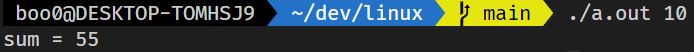
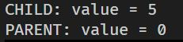

# 멀티 스레딩 모델 (user thread, kernel thread)

- 스레드에는 유저 스레드와 커널 스레드가 있습니다.

- 이전에 자바를 사용해서 스레드에 대한 실습을 진행했습니다. JVM은 가상 머신이고 운영체제가 아니기 때문에 자바에서 멀티 스레딩을 하더라도 그 스레드가 CPU 코어를 하나씩 점유하는 형태로 멀티 스레딩을 할 수는 없습니다. 이러한 스레드를 `유저 스레드`라고 합니다.

- 운영체제는 하드웨어에 직접 접근할 수 있기 때문에 스레드 하나에 CPU 코어 하나를 점유하도록 할 수 있습니다. 이러한 스레드를 `커널 스레드`라고 합니다.

- `유저 스레드`에 대한 보충 설명은 커널 모드가 아닌 유저 모드에서 커널 서포트 없이 실행되고 `커널 스레드`는 운영체제로부터 서포트를 받고 운영체제가 직접 관리하는 스레드입니다.

## 유저 스레드와 커널 스레드의 관계

- `Many-to-one Model` - CPU 코어에 할당된 하나의 커널 스레드가 여러개의 유저 스레드를 담당할 수 있습니다.

- `One-to-One Model` - 하나의 커널 스레드가 하나의 유저 스레드를 담당합니다.

- `Many-to-Many Model` - 여러개의 유저 스레드가 여러개의 커널 스레드의 도움을 받습니다.

## 스레드 라이브러리

- 스레드 라이브러리는 스레드를 생성하고 관리하는 API를 제공합니다.

- 오늘날 쓰이는 스레드 라이브러리는 대표적으로 POSIX Pthreads와 Windows thread, Java thread가 있습니다.

- POSIX Pthreads는 UNIX-like 운영체제에서 사용되고 Windows thread는 윈도우 운영체제에서 사용됩니다.

- Java thread는 커널 스레드의 도움이 필요하기 때문에 호스트 OS가 어떤 것인지에 따라 Pthreads를 이용하거나 Windows thread를 이용합니다.

## Pthreads

- Pthreads는 POSIX(IEEE 1003.1c)가 스레드 생성과 동기화를 위해 제정한 표준 API입니다.

- Pthreads는 스레드의 동작에 관한 명세일 뿐 스레드의 생성과 종료에 대한 구현은 아닙니다. 그렇지만 운영체제는 그 명세에 대한 구현을 사용자가 사용할 수 있도록 구현을 해두었습니다.

- pthreads.c에서 runner 함수는 Pthread로 생성한 스레드에게 할당할 작업을 의미합니다. 생성한 스레드에 runner를 수행하도록 하고 main 함수의 argv[] 인자를 전달하기 위해서(argv[0]은 실행 경로) `./a.out [숫자]`로 실행 파일을 실행하면 다음과 같은 결과를 얻을 수 있습니다.

- 

## 프로세스의 생성과 스레드 생성의 차이

- Pthreads2.c에서 `fork()`로 자식 프로세스를 생성하고 그 자식 프로세스는 스레드를 생성해서 스레드에 전역 변수의 값을 변경하는 작업을 수행하게 합니다.

- 이전에 `wait()` 시스템 콜을 실습하면서 프로세스의 생성을 하더라도 자식 프로세스는 새로운 자신만의 메모리 공간에 존재하기 때문에 영향을 주지 않는 것을 확인했습니다.

- 하지만 한 프로세스 스레드를 생성해서 변수의 값을 변경시키도록 하는 경우엔 프로세스의 값이 변경됩니다. 이유는 스레드는 그 프로세스 내의 자원과 데이터를 사용하기 때문에 스레드가 값을 변경하면 그 변수의 주소는 프로세스 내의 메모리 공간에 있는 같은 변수의 값을 변경시키는 것입니다.

- 