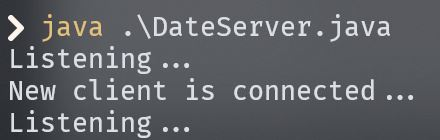
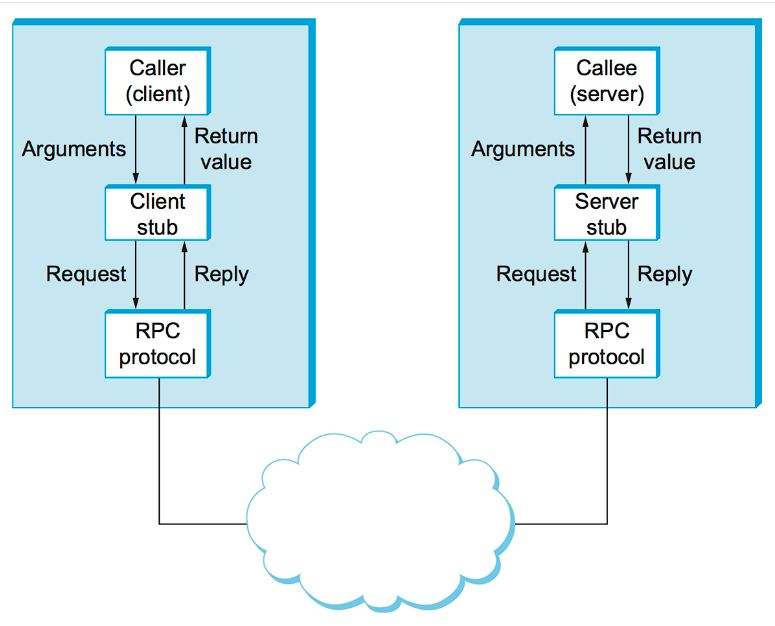

# 클라이언트-서버 시스템

- 클라이언트-서버 시스템에서 통신 방식으로는 두가지가 있습니다. 하나는 소켓 통신이고 다른 하나는 원격 프로시저 호출입니다.

# 소켓

- 소켓은 통신의 끝점을 정의하는 역할을 합니다. 두 프로세스가 네트워크상에서 통신을 하려면 두개의 소켓이 필요합니다.

- 소켓은 IP 주소와 포트 번호를 접합해서 구별합니다. 0.0.0.0:80과 0.0.0.0:1625는 다른 프로세스로 구별됩니다.

- 

- 소켓 통신이 이루어지는 과정을 풀어서 설명하면 다음과 같습니다. 도메인 네임이 다음과 같을 경우 `https://google.com/` DNS에서 도메인이 IP 주소로 변경되고 생략되어 있는 포트 번호와 접합되어 클라이언트의 요청을 받을 서버의 주소가 됩니다. 그리고 해당 주소로 도메인 네임 뒤 URI에 명시된 특정 요청이 전달되고 해당 요청에 대한 응답이 사용자의 주소로 전달됩니다.

## 자바 소켓

- 자바는 다음과 같은 소켓 인터페이스를 제공합니다.

- 소켓 - 연결성(TCP)

- 데이터그램 소켓 - 비연결성(UDP)

- 멀티캐스트 소켓 - 여러 수신자에게 송신 가능

## 자바 소켓 프로그래밍

- 서버 프로세스에서 포트를 명시해서 서버를 열고 표준 출력에 write해서 데이터를 전달합니다.

- 클라이언트 프로세스는 같은 포트를 명시해서 소켓을 생성합니다. 그리고 버퍼 리더를 생성하고 표준 입력으로 전달되는 데이터를 저장함으로서 데이터를 전달받습니다.

- 

- 

# 원격 프로시저 호출 (Remote Procedure Calls)

- 네트워크상의 두 시스템 사이의 통신을 프로시저 호출을 추상화하기 위한 방편으로 설계한 방식으로 가장 일반적인 원격 서비스의 형식입니다.

- 서버가 제공하는 프로시저를 클라이언트가 로컬 환경에서 원격으로 사용할 수 있는 것입니다.

- 

- RPC 시스템은 클라이언트에 stub을 제공합니다.

- 클라이언트가 원격 프로시저를 호출하면 RPC는 그에 대응하는 stub을 호출하고 원격 프로시저가 필요로 하는 매개변수를 전달합니다. 그리고 stub이 서버의 포트를 찾고 매개변수를 정돈(marshall)해서 메세지 패싱 방식으로 서버에 메세지를 전달합니다.

- stub은 서버에도 존재합니다. 메세지를 받은 서버의 stub은 요청된 프로시저를 호출하고 필요한 경우 반환 값들도 정돈해서 응답을 보냅니다.

- 매개변수를 정돈(marshall)하는 이유는 클라이언트와 서버의 데이터 표현 방식이 다를 경우에 대비하기 위해서 입니다.

- 한 쪽의 컴퓨터는 32비트의 정수를 최상위 바이트부터 저장하고 다른 한 쪽은 최하위 바이트부터 저장한다면 데이터 표현의 차이가 생깁니다.

- 이와 같은 차이를 해결하기 위해 대부분의 RPC 시스템은 중립적인 데이터 표현 방식을 사용해서 정돈합니다.

