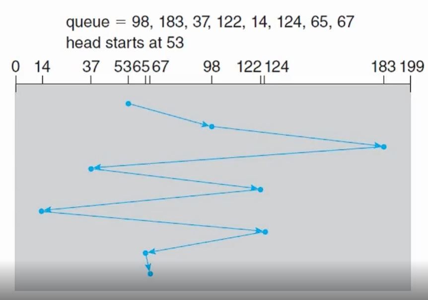
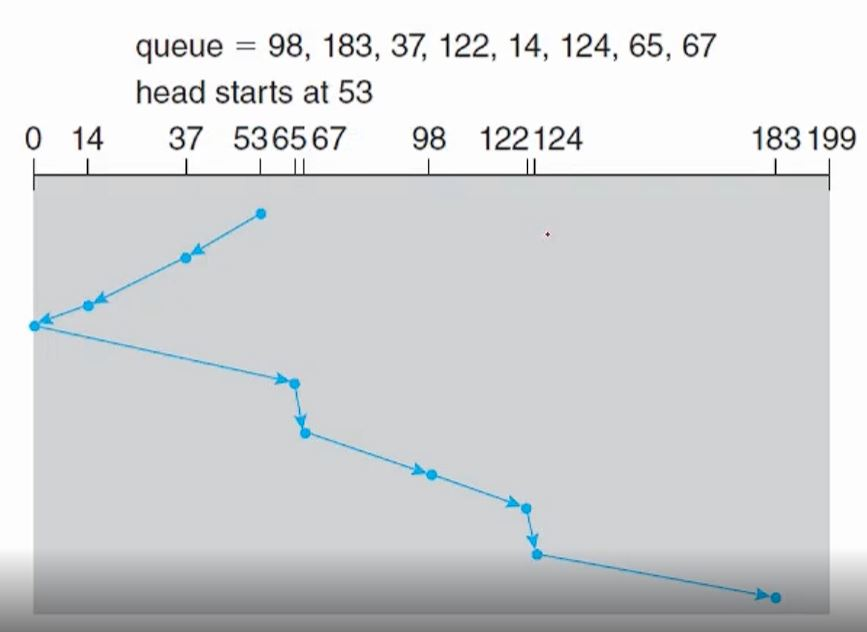
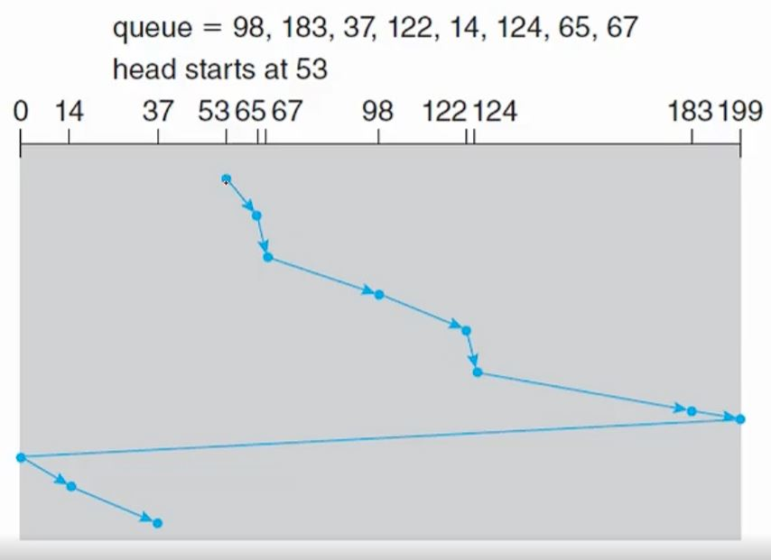

# 하드 디스크 (Hard Disk Drive)

- 

- 

- 하드 디스크는 원형의 자기 물질로 덮인 플래터에 정보를 기록하여 저장합니다.

- 플래터의 표면은 여러개의 트랙으로 논리적으로 분리되어있고 트랙은 여러개의 섹터로 나누어져 있습니다.

- 그리고 같은 암 위치에 있는 트랙의 집합은 실린더를 형성합니다.

- 헤드는 디스크를 읽고 쓰는 역할을 하며 디스크 암에 부착되어 있습니다.

## 하드 디스크 스케줄링

- 하드 디스크 스케줄링의 목표는 접근 시간 그 중에서도 탐색 시간을 최소화 하고 데이터 전송의 대역폭을 최대화하는 것입니다.

- 탐색 시간(seek time)은 원하는 실린더로 디스크 암이 움직이는 데에 걸리는 시간이며 회전 지연(rotational latency)은 플래터가 회전하여 원하는 섹터가 디스크의 헤드에 위치하게 되는 데에 걸리는 시간입니다.

- 디스크 대역폭(bandwidth)은 단위 시간당 전송되는 총 바이트 수이며 첫번째 요청과 마지막 전송 사이에 전송된 데이터의 총량입니다.

## FIFO 스케줄링

- 선입선출 방식의 스케줄링으로 최적의 속도를 제공하지는 않습니다.

- 

- 위와 같은 순서로 실린더 넘버를 접근하고 헤드가 53에서 시작한다면 총 헤드의 이동거리는 640 실린더입니다.

## SCAN 스케줄링

- 디스크 암이 한쪽 끝에서 다른 끝까지 움직이면서 요청된 실린더에 도달할 때 요청을 처리하는 방식입니다.

- 한 방향으로 이동이 끝나면 해당 끝점부터 반대쪽 끝점까지 다시 디스크 암의 이동이 시작됩니다.

- 

- 헤드의 총 이동거리는 236으로 FIFO 방식보다 처리 속도가 빠른 것을 확인할 수 있습니다.

## C-SCAN (Circular-SCAN) 스케줄링

- SCAN 방식과 비슷하지만 각 요청에 걸리는 시간을 좀 더 균등하게 하는 방식입니다.

- 헤드가 한쪽 끝에 도착했을 때 다른 끝으로 이동하면서 요청을 처리하지 않고 0번 실린더로 이동한 후 반대쪽 끝으로 이동하면서 요청을 처리합니다.

- 실린더를 하나의 순환 리스트로 간주한다고 볼 수 있습니다.

- 