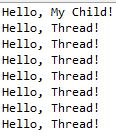
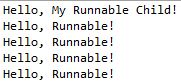
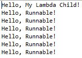
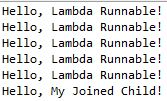
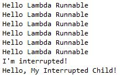

# 스레드

- 스레드는 CPU를 사용하는 가장 작은 단위이며 프로세스가 수행하는 작업의 주체입니다.

- 하나의 스레드는 스레드 ID(TID), 프로그램 카운터, 레지스터 집합, 스택으로 구성되어 있습니다.

## 멀티 스레딩

- 

- 프로세스가 여러 스레드를 사용할 수 있다면 하나의 작업을 한 스레드에게 맡기고 논블로킹으로 다른 작업을 다른 스레드에 할당하는 방식으로 여러 작업을 동시에 진행할 수 있습니다.

## 멀티 스레딩의 장점

- 응답성 - 프로세스의 일부분이 중단되거나 긴 작업을 수행하더라도 프로세스의 실행이 지속되어 사용자에 대한 응답성이 증가합니다. 멀티 스레딩을 사용하도록 프로그래밍된 웹 어플리케이션의 경우 한 스레드가 이미지의 다운로드를 진행하는 동안 다른 스레드에서 사용자와의 상호작용을 지속할 수 있습니다.

- 자원의 공유 - 스레드들은 프로세스의 자원을 공유하기 때문에 공유 메모리나 메세지 패싱 등의 통신이 쉽습니다.

- 경제성 - 프로세스를 하나 생성하는 것 보다 스레드를 생성하는 것이 더 경제적입니다. 그리고 스레드간의 문맥 교환이 프로세스간의 문맥 교환보다 더 빠릅니다.

- 확장성 - 멀티 스레딩이 가능해지면 프로세스는 멀티 프로세서 아키텍처의 장점을 얻을 수 있습니다. 예를들면 프로세서의 코어가 여러개라면 각 코어에 스레드를 할당해 병렬 처리를 할 수 있습니다.

## 자바에서의 스레드

- 자바에서 스레드는 프로그램 실행의 기본적인 모델입니다. 언어의 개발부터 스레드 모델을 도입해서 개발이 되었습니다.

- 스레드와 관련된 다양한 API가 제공되기 때문에 스레드의 생성과 관리가 쉽습니다.

## 자바에서 스레드를 생성하는 3가지 방법

- `Thread`라는 클래스를 상속받은 클래스를 생성해 오버라이드해서 사용합니다. 하지만 이 방식은 다중 상속이 불가능하기 때문에 다른 클래스를 사용할 수 없습니다.

- `Runnable` 인터페이스를 Implementing해서 사용합니다.

- 람다 익스프레션을 사용해서 `Runnable`인터페이스를 대체합니다.

## Thread 클래스 상속받아 사용하기

- `Thread` 클래스를 상속한 클래스 Thread1을 생성합니다.

- ThreadExample1은 Thread1 객체를 생성해서 `thread.start()`로 Thread1에게 명령된 작업을 시작하도록 해서 0.5초마다 `Hello, Thread!`라는 문구가 출력이 됩니다.

- 스레드의 생성은 자식 프로세스를 생성했을 때와 같이 스레드의 생성을 명령한 스레드는 자신에게 할당된 작업을 그대로 멈추지 않고 끝까지 수행합니다.

- 

- 그렇기 때문에 `Hello, Child!`가 먼저 출력이 되고 그 후 생성된 스레드의 작업(0.5초 마다 출력)이 진행됩니다.

## Runnable 클래스 implementation해서 사용하기

- `Runnable`클래스를 implementation해서 클래스를 작성한 후 메인 스레드에서 객체를 생성할 때는 `Thread` 클래스의 객체를 생성하면서 생성자의 인자로 `Runnable`클래스의 생성자를 전달합니다.

- 

- 구현 방식은 다르지만 ThreadExample2에서의 스레드 생성과 ThreadExample1의 스레드 생성은 같은 결과를 낸다는 것을 확인할 수 있습니다.

## Runnable 인터페이스를 람다 익스프레션으로 사용하기

- 람다 익스프레션을 사용해 메인 함수 내에서 Runnable 스레드 객체에 대한 implementation을 해서 사용합니다. 실행 결과는 다른 방식과 동일합니다.

- 

## 부모 스레드의 대기 (join)

- 프로세스의 실습에서 `fork()`를 사용해 자식 프로세스를 생성한 후 부모 프로세스에서 `wait()`를 호출해 자식 프로세스의 작업이 끝날 떄 까지 대기를 시킬 수 있었습니다.

- 스레드의 생성에서도 부모 스레드가 자식 스레드의 작업이 끝날 떄 까지 `join()`을 사용해 대기를 할 수 있습니다.

- ThreadExample4에서 자식 스레드의 `start()`이후 부모 스레드는 `join()`을 try합니다. 인터럽트되지 않았다면 자식 스레드의 작업이 끝난 이후 부모 스레드의 작업이 진행되므로 실행 결과는 다음과 같습니다.

- 

## 스레드의 종료 (interrupt)

- 스레드도 프로세스의 상태와 같이 wait, ready, running 등의 상태를 가지고 있고 종료 상태 또한 존재합니다.

- 자바에서 스레드를 종료할 때 `stop()`을 사용할 수 있지만 문제가 발생할 수 있기 때문에 `interrupt()`를 사용해 스레드를 종료합니다.

- ThreadExample5에서 자식 스레드의 생성과 작업의 시작 이후 부모 스레드는 0.5초의 sleep 이후 자식 스레드에 인터럽트를 가하고 자신의 작업을 마칩니다.

- 그 후 자식 스레드는 인터럽트 되었을 때의 에러 문구를 출력하고 종료됩니다.

- ThreadExample5에서 유의해야할 점은 부모 스레드의 마지막 작업 종료 문구 출력과 자식 스레드의 인터럽트 에러 출력 문구의 순서는 멀티 스레드 환경이기 때문에 예측 가능하지 않다는 것입니다.

- 

- 중단점을 잡아 디버깅했을 경우에는 인터럽트가 되었을 때 자식 스레드가 종료되어 인터럽트에 대한 에러 문구가 먼저 출력되는 예측할 수 있는 결과가 나왔으나 이전의 결과는 그렇지 않았습니다.