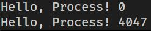

# wait

- `fork()`로 자식 프로세스를 생성한 후 부모 프로세스는 자신이 가진 instruction을 계속해서 실행합니다. 

- `wait()` 시스템 콜을 사용하면 부모 프로세스를 Ready Queue에서 Wait Queue로 이동시켜서 자식 프로세스가 실행되고 종료될 때 까지 기다리게 할 수 있습니다.

- wait.c 파일의 내용을 보면 pid가 0 이상이라면 `wait()`를 호출합니다. 이것은 자식 프로세스는 `fork()` 시스템 콜의 반환 값이 0이기 때문에 부모 프로세스의 경우에만 `wait()`를 호출하게 할 수 있습니다.

- 실행 결과는 다음과 같습니다.            
           
  부모 프로세스는 `wait()`를 호출했기 때문에 자식 프로세스가 먼저 끝까지 실행되어 결과를 출력했고 그 다음 부모 프로세스가 결과를 출력하고 종료된 것을 알 수 있습니다.

## wait() 콜 이후 변수의 값

- global_var_wait.c 파일의 실행 결과는 다음과 같습니다.         
  

- 결과가 20이 아니라 5인 이유는 `wait()`의 호출로 자식 프로세스에서 변수의 값을 먼저 변화시키더라도 부모 프로세스의 해당 변수의 값까지 변하지는 않기 때문입니다.
